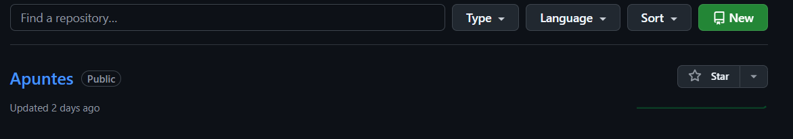

# Apuntes

## Indice
<ol>
    <li a href="#github">Github</li>
    <li>Markdown</li>
    <li>HTML</li>
</ol>

## Github 

## Comandos para github

    - git init --> Inicializa/reinicia el repositorio
    - git clone url --> clona el repositorio localmente
    - git pull --> baja el archivo a local
    - git branch --> indica donde esta la raiz
    - git push -u origin main --> pasar de zona intermedia a github
    - git branch -M main --> configura la rama MAIN
    - git add . --> Pone TODO el directorio en la zona intermedia
    - git commit (-m) "comentario" --> Sube el archivo a la zona intermedia.
    - git push origin main --> subimos ruta a main
    - git add README.md --> Pone la trama en la zona intermedia 
    - git remote add (se genera main automatico)

# Como se crea un Repositorio

1. En la página principal de GitHub, nos dirigimos a *New*para crear un repositorio 

2. Personalixando tu repositorio
## Markdown

### Encabezados y sus niveles
## Segundo nivel 
### Tercer nivel 
#### Cuarto nivel
##### Quinto nivel

Estos son los apuntes de *0373* del ciclo formativo de _ASIX_ o **DAW** del curso __2425__

1. Primer titulo de lista
    1. Primer elemento de la lista 1
    2. Segundo elemento de la lista 1

2. Segundo titulo de la lista
    * Primer elemento de la lista 2
    * Segundo elemento de la lista 2
3. Tercer punto de la lista

- Primer punto de lista desordenada
* Segundo punto de lista desordenada
+ Tercer punto de lista desordenada

Lorem Ipsum
La primer clase de **_markdown_** y HTML pueden anidarse en VS code

### insertar imagenes

### InsertarEnlace
[titulodeenlace](URL "Titulo opcional")

[Página web de Amazon](https://amazon.com)"Amazon")

## HTML

