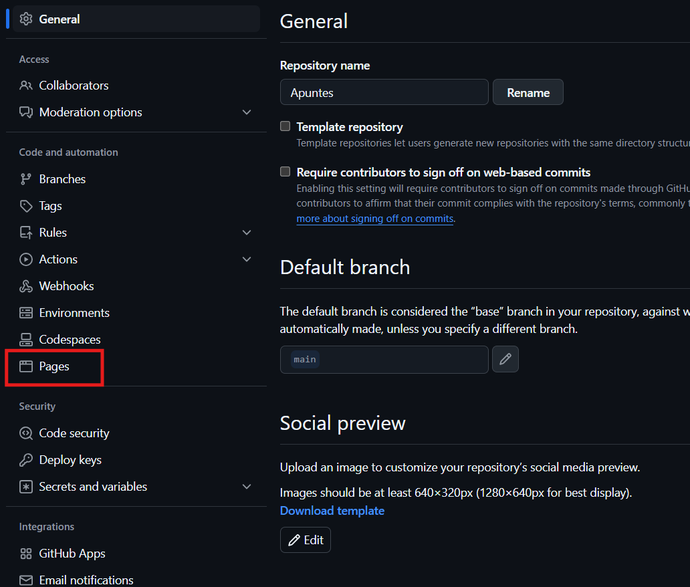
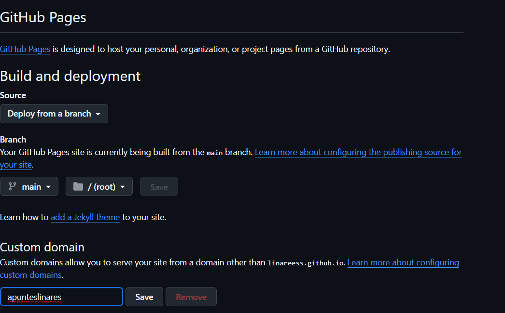

# Apuntes

## Indice
<ol>
    <li>Github</li>
    <li>Markdown</li>
    <li>HTML</li>
</ol>

## Github 
<br>
## Comandos para github

    - git init --> Inicializa/reinicia el repositorio
    - git clone url --> clona el repositorio localmente
    - git pull --> baja el archivo a local
    - git branch --> indica donde esta la raiz
    - git push -u origin main --> pasar de zona intermedia a github
    - git branch -M main --> configura la rama MAIN
    - git add . --> Pone TODO el directorio en la zona intermedia
    - git commit (-m) "comentario" --> Sube el archivo a la zona intermedia.
    - git push origin main --> subimos ruta a main
    - git add README.md --> Pone la trama en la zona intermedia 
    - git remote add (se genera main automatico)

# Como se crea un Repositorio

1. En la página principal de GitHub, nos dirigimos a *New*para crear un repositorio 


2. Personalizar tu repositorio
    Un repositorio permite cierta personalización, por ejemplo a la hora de crearlo, podemos decidir si queremos que tenga o no un archivo 
    .md por defecto o no, tambien permite gestionar el acceso, ("publico""privado"), Permite agregar una descripcion para distinguir el repositorio.

3. Pages
    Podemos publicar nuestra pagina web de manera publica gracias al hosting gratuito que ofrece github.

en la foto vemos que en la configuracion individual de cada repositorio permite su propio github pages.

en esta foto vemos que podemos personalizar el dominio, y escoger la rama de visualizacion de usuario de la pagina.

## Markdown

### Encabezados y sus niveles
## Segundo nivel 
### Tercer nivel 
#### Cuarto nivel
##### Quinto nivel
###### sexto nivel de encabezado

Estos son los apuntes de *0373* del ciclo formativo de _ASIX_ o **DAW** del curso __2425__

1. Primer titulo de lista
    1. Primer elemento de la lista 1
    2. Segundo elemento de la lista 1

2. Segundo titulo de la lista
    * Primer elemento de la lista 2
    * Segundo elemento de la lista 2
3. Tercer punto de la lista

- Primer punto de lista desordenada
* Segundo punto de lista desordenada
+ Tercer punto de lista desordenada

## mostrar codigo
    ```
    <!DOCTYPE HTML >
    <HTML lang="en">
        <HEAD>
            <TITLE></TITLE>
        </HEAD>
        <BODY>
        </BODY>
    </HTML>
    
    ```
<br>

La primer clase de **_markdown_** y HTML pueden anidarse en VS code

### insertar imagenes

### InsertarEnlace
[titulodeenlace](URL "Titulo opcional")

[Página web de Amazon](https://amazon.com)"Amazon")

Tabla

|Nombre|Enlace a documentacion|
|--------|--------------------|
|HTML| [enlace](https://html.spec.whatwg.org/) |
|XML| [enlace](https://www.w3.org/XML/) |
|SMGL| [enlace](https://www.w3.org/TR/sgml-dtd/) |
|XHTML| [enlace](https://www.w3.org/TR/xhtml1/) |
|Markdown| [enlace](https://daringfireball.net/projects/markdown/) |


|Titulo a | Titulo b | Titulo c | Titulo d|
|--------|------------|------|----|
|asix|2024|25|26|
|smx|24|25|26|
|daw|24|25|26|

## HTML

## 4. ¿Que es HTML? ¿Como se esctructura?
HTML es un lenguaje de marcas usado para estructurar y crear paginas web de forma legible para el usuario.

1. Elementos principales

* html5: Define la estructura básica del documento HTML.
* head: Contiene metadatos e información no visible directamente en la página.
* link: Sirve para enlazar otros documentos o recursos.
* title: Proporciona un título para la página que aparece en la barra de navegación.
* body: Es el cuerpo donde se coloca el contenido visible de la página.
* div: Permite dividir el contenido en secciones.
* h1: Define el encabezado principal.
* h2: Representa un encabezado de segundo nivel.
* h3: Define un encabezado de tercer nivel.
* li: Elemento de lista.
* ul: Lista no ordenada.
* ol: Lista ordenada.
* a: Crea enlaces a otras páginas o recursos.
* p: Define un párrafo.
* img: Inserta una imagen en la página.
* br: Inserta un salto de línea.
* hr: Inserta una línea horizontal como separador.

## Elementos Secundarios

1. content: Se utiliza para especificar el contenido de la página.
2. rel: Relaciona un recurso con otro, como una página vinculada.
3. href: Define la URL a la que apunta un enlace.
4. id: Asigna un identificador único a un elemento.
5. src: Especifica la fuente de una imagen o archivo.
6. type: Define el tipo de entrada o recurso.
7. alt: Proporciona un texto alternativo para los elementos multimedia si no se pueden cargar.

### Elementos de Estilo

+ strong: Aplica un formato en negrita al texto.
* em: Aplica un formato en cursiva al texto.
+ u: Subraya el texto.
* width: Define el ancho de un elemento.
* height: Define la altura de un elemento.


