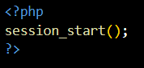

# Apuntes de Llenguatge de Marques

## Índice

1. [Introducción a Markdown](#introducción-a-markdown)
2. [HTML - Introducción y estructura básica](#html---introducción-y-estructura-básica)
3. [Formularios HTML](#formularios-html)
4. [Tablas en HTML](#tablas-en-html)
5. [Posicionamiento y Box Model en CSS](#posicionamiento-y-box-model-en-css)
6. [Flexbox y maquetación](#flexbox-y-maquetación)
7. [CSS - Fundamentos, Selectores y Especificidad](#css---fundamentos-selectores-y-especificidad)
8.[Bootstrap](#Bootstrap)
9. [Diseño Responsive](#diseño-responsive)
10. [GitHub y gestión de repositorios](#github-y-gestión-de-repositorios)
11. [XML](#xml)
12. [Validación de Formulario y Manejo de Sesiones en PHP](#Validación-de-Formulario-y-Manejo-de-Sesiones-en-PHP)

---

## Introducción a Markdown

Markdown permite formatear texto de forma sencilla y compatible con múltiples plataformas (GitHub, VSCode, editores online...).

### Estructura de encabezados

- `#` Título nivel 1  
- `##` Título nivel 2  
- `###` Título nivel 3  
- `####` Título nivel 4  
- `#####` Título nivel 5  

### Listas y sublistas

```markdown
- Primer punto
  - Subpunto 1
  - Subpunto 2
- Segundo punto
```

### Insertar código

Usamos triple tilde o comillas invertidas:

```
`código inline`
```

```bash
git clone "link repositorio""
```

### Insertar imágenes

```markdown

```

Ejemplo:

```markdown

```

### Insertar enlaces

```markdown
[Jesuites Bellvitge](https://jesuitesbellvitge.cat)
```

## HTML - Introducción y estructura básica

### Estructura general HTML5

html
<!DOCTYPE html>
<html lang="es">
  <head>
    <meta charset="UTF-8">
    <title>Título de la Página</title>
    <link rel="stylesheet" href="styles.css">
  </head>
  <body>
    <!-- contenido -->
  </body>
</html>
```

### Etiquetas más comunes

- `head`, `title`, `meta`, `link`
- `body`, `div`, `main`, `section`, `aside`
- `h1` a `h6`: Encabezados
- `ul`, `ol`, `li`: Listas
- `a`: Enlaces
- `img`: Imágenes
- `p`: Párrafos
- `br`, `hr`: Saltos y líneas horizontales

---

## Formularios HTML

```html
<form action="procesar.php" method="post">
  <fieldset>
    <legend>Datos personales</legend>
    <label for="nombre">Nombre:</label>
    <input type="text" id="nombre" name="nombre" placeholder="Tu nombre" required>
  </fieldset>
  <button type="submit">Enviar</button>
</form>
```

### Atributos clave

- `action`, `method`, `name`, `placeholder`, `required`, `readonly`, `disabled`, `onclick`,
- `select`, `option`, `textarea`, `input type="radio|checkbox|submit"`

---

## Tablas en HTML

```html
<table border="1">
  <thead>
    <tr>
      <th>Curso</th><th>Año</th><th>Alumnos</th>
    </tr>
  </thead>
  <tbody>
    <tr>
      <td>ASIX</td><td>2425</td><td>26</td>
    </tr>
  </tbody>
</table>
```

### Combinar celdas

- Horizontal: `colspan="2"`
- Vertical: `rowspan="2"`

### Colores de fondo y alineación

```html
<tr align="center" bgcolor="#00ff00">
```

---

## Posicionamiento y Box Model en CSS

```css
.container {
  width: 100px;
  height: 100px;
  background-color: blue;
  padding: 10px;
  box-sizing: border-box;
}
```

### Overflow

- `hidden`, `scroll`, `visible`, `auto`
- `text-overflow: ellipsis` (¡requiere `overflow: hidden`!)

### Tipos de `position`

- `static`, `relative`, `absolute`, `fixed`, `sticky`

---

## Flexbox y maquetación

```css
.container {
  display: flex;
  flex-direction: row;
  justify-content: space-between;
  align-items: center;
  flex-wrap: wrap;
}
```

### Propiedades clave

- `flex-direction`: `row`, `column`, `row-reverse`
- `justify-content`: `center`, `space-around`, `space-between`
- `align-items`: `flex-start`, `flex-end`, `center`
- `order`, `flex-grow`

---

## CSS - Fundamentos, Selectores y Especificidad

### Tipos de CSS

- Inline: `style="color:red"`
- Interno: dentro de `<style>`
- Externo: usando `<link rel="stylesheet" href="style.css">`

### Especificidad

| Tipo de estilo | Valor |  
|----------------|-------|  
| Inline         | 1000  |  
| Interno        | 100   |  
| Externo        | 10    |  

```css
h1 {
  color: red !important;
}
```

### Selectores

- Básicos: `h1`, `p`
- Clases: `.clase`
- ID: `#id`
- Hijos directos: `div > p`
- Descendientes: `div p`
- Hermanos adyacentes: `h1 + p`
- Pseudoclases: `a:visited`, `input:focus`
- Pseudoelementos: `p::first-line`

---
## Bootstrap
### ✅ ¿Qué es Bootstrap?
Framework CSS y JS para crear webs responsivas de forma rápida.

### 🚀 Ventajas
- Responsive por defecto.
- Componentes ya diseñados.
- Muy usado y bien documentado.

### 🔗 Incluir Bootstrap
```html ejemplos
<link href="https://cdn.jsdelivr.net/npm/bootstrap@5.3.2/dist/css/bootstrap.min.css" rel="stylesheet">
<script src="https://cdn.jsdelivr.net/npm/bootstrap@5.3.2/dist/js/bootstrap.bundle.min.js"></script>
```
## Diseño Responsive

### Mobile First

Diseñar pensando primero en móviles.

```css
@media (min-width: 768px) {
  body {
    background-color: lightblue;
  }
}
```
### Ejemplo de CSS Mobile First:

    /* Estilos para dispositivos móviles (por defecto) */
    body {
    background-color: lightyellow; /* Fondo para dispositivos móviles */
    font-size: 14px; /* Fuente pequeña para móviles */
    }

    /* Estilos para pantallas más grandes (tabletas y mayores) */
    @media (min-width: 768px) {
    body {
        background-color: lightblue; /* Fondo para pantallas más grandes */
        font-size: 16px; /* Aumento del tamaño de la fuente */
    }
    }

    /* Estilos para pantallas grandes (escritorios) */
    @media (min-width: 1024px) {
    body {
        background-color: lightgreen; /* Fondo para pantallas de escritorio */
        font-size: 18px; /* Aumento adicional de la fuente */
    }
    }

## GitHub y gestión de repositorios

## Pages
Github permite hostear nuestra web desde su servicio de Github pages, para ello solo debemos entrar a la configuracion del repositorio en settings y publicar la web desde la rama main.


### Crear un repositorio

1. Accede a GitHub
2. Pulsa en **New**
3. Introduce nombre, descripción, visibilidad
4. Marca **Add README**
5. Clic en **Create Repository**


### Comandos básicos

```bash
git clone URL
git init
git branch
git branch -M main
git add .
git commit -m "comentario"
git remote add origin URL
git push -u origin main
git pull
```
## XML

XML (extensible Markup Language) es un lenguaje de marcas que sirve para almacenar y transportar datos.

No define cómo se muestran los datos, solo su estructura.

### Estructura Básica
Ejemplo:
<?xml version="1.0" encoding="UTF-8"?>
<persona>
  <nombre>Juan</nombre>
  <edad>30</edad>
  <email>juan@example.com</email>
</persona>
Todo documento XML debe tener un único elemento raíz (<persona> en este caso).
Las etiquetas deben estar correctamente anidadas y cerradas.

Imagen ej:


### Reglas Básicas
- Debe tener un único elemento raíz.
- Las etiquetas son sensibles a mayúsculas/minúsculas.
- Todos los elementos deben tener una etiqueta de cierre.
- Los atributos deben ir entre comillas:
EJEMPLO:
<usuario nombre="Carlos" edad="25" />

### Atributos vs Elementos

Con atributos:
    <persona nombre="Ana" edad="28" />
Con elementos:
    <persona>
    <nombre>Ana</nombre>
    <edad>28</edad>
    </persona>

### Declaración XML

Esta es la estrucutura que declara que el archivo esta en formsto xml. 
    <?xml version="1.0" encoding="UTF-8"?>

## Validación de Formulario y Manejo de Sesiones en PHP
Objetivo:
    -Validar el input de un formulario con condiciones, como verificar si un valor es correcto o si el formulario fue enviado.

    -Manejo de sesiones para recordar información y redirigir al usuario según el resultado de la validación.



### Ejemplo de Validación en PHP

### 1. Obtener Datos del Formulario

    $pokemon = $_POST['pokemon'];

### 2. Validación Condicional

if (isset($_POST['index']) && $_POST['pokemon'] == 'pikachu') {
  // Si el formulario se envió (index) y el Pokémon es 'pikachu'
  echo "¡Correcto!";
}

### 3. Iniciar una Sesión y Guardar Información

session_start(); 
$_SESSION['pantalla1'] = 'check'; 

### 4. Mostrar Mensajes de Error

if (isset($_GET['msg'])) {
  echo "Error, intenta con el pokemon: " . $_GET['msg'];
}


